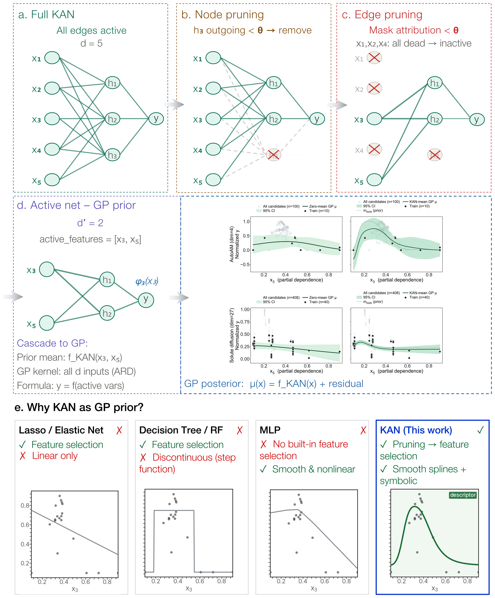
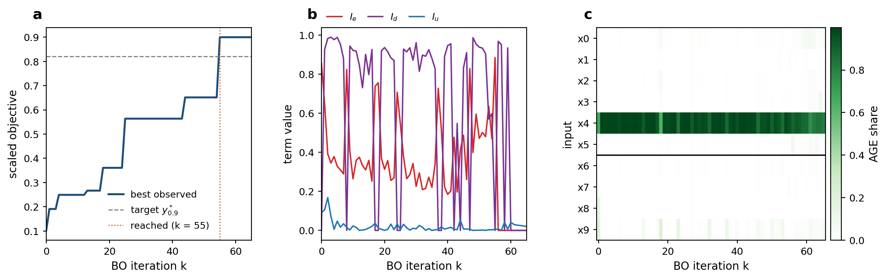
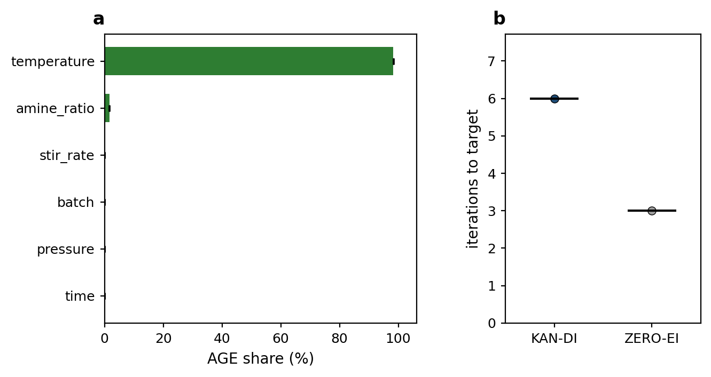

# KAN-DI: Discriminative Bayesian Optimization with a Kolmogorov–Arnold Prior

[](https://github.com/nicechoi99/kan-di/actions/workflows/ci.yml)
[](https://colab.research.google.com/github/nicechoi99/kan-di/blob/main/examples/kan_di_colab.ipynb)
[](https://doi.org/10.5281/zenodo.22652792)
[](https://opensource.org/licenses/MIT)
[](https://www.python.org/downloads/)

Reference implementation for the paper
**"Experimental Design for Descriptor Discovery: Kolmogorov–Arnold Prior with Discriminative Bayesian Optimization."**

Bayesian optimization finds a good experiment, but it does not tell you *which* descriptors decided
the outcome. KAN-DI makes one optimization loop do both. A Kolmogorov–Arnold Network (KAN) is fitted
to the measurements, pruned to a closed-form expression, and installed as the **prior mean of a
Gaussian process**. The gradients of that expression rank the descriptors, and a **composite
acquisition function** chooses the next experiment to raise the response, to separate the two leading
descriptors, and to spread measurements along the leading one.

The paper calls the full framework **KAN-DoE**. **KAN-DI** is its discriminative composite
acquisition, and the variant reported in the paper is `DI-UCB-H`. This repository implements both.

## How KAN-DI works, in one figure

<p align="center">
  
</p>

**a)** A full KAN with five inputs and all edges active. **b)** Node pruning removes the hidden node
whose outgoing activations fall below the threshold θ. **c)** Edge pruning masks the edges whose
attribution falls below θ, and inputs whose edges are all masked become inactive. **d)** The pruned
network (here two active descriptors) supplies the GP prior mean `m(x) = f_KAN(x)`, while the GP kernel
spans all inputs with ARD lengthscales; right, GP posteriors with a zero prior mean and with the KAN
prior mean on AutoAM (10 training points) and dilute-solute diffusion (40 training points). **e)** Why a
KAN as the prior: it selects descriptors by pruning, like Lasso or a tree, and stays smooth and
nonlinear, like an MLP. The descriptor ranking (AGE) is read from the derivatives of `f_KAN`, and the
composite acquisition `α(x) = I_e(x) + I_d(x) + I_u(x)` uses it to choose the next experiment (see
**How it works**). This is Supplementary Fig. S1 of the paper.

## Try it

Three ways to rank the descriptors of a table of experiments you have already run (details under
[Analyze your own data](#analyze-your-own-data)):

| | How | Install |
|---|---|---|
| **Colab** | [Open the notebook](https://colab.research.google.com/github/nicechoi99/kan-di/blob/main/examples/kan_di_colab.ipynb), run the example, then upload your CSV | none |
| **Web app** | `pip install -r requirements.txt -r requirements-app.txt`, then `streamlit run app/streamlit_app.py` | local |
| **Command line** | `python analyze.py data.csv --target yield` | local, see [Installation](#installation) |

The web app runs the same analysis as `analyze.py` (it calls `analyze.analyze`). To host it, deploy
the repository on [Streamlit Community Cloud](https://streamlit.io/cloud) with `app/streamlit_app.py` as
the entry point and Python 3.12; the CPU dependencies are in `app/requirements.txt`.

<p align="center">
  
</p>

One run of the bundled quickstart (Hartmann-6 with four padded inputs that do not enter the response,
400 candidates, seed 0). **a)** Best observation so far; this run passes the target `y_0.9*` at
iteration 55. **b)** The three acquisition terms at the point chosen in each iteration. **c)** Share of
average gradient energy (AGE) per input over the run; `x0`–`x5` are genuine, `x6`–`x9` (grey labels,
below the line) are padded. At the last iteration the genuine inputs hold 0.91 of the gradient energy
and the padded inputs 0.09. The figure is regenerated by `docs/make_readme_figures.py` and shows what
the released code does on one seed, not a result from the paper.

## Highlights

- **Optimization and descriptor identification in one loop.** The KAN prior mean supplies a ranking of
  the descriptors at every iteration, in addition to the GP posterior used for optimization.
- **Interpretable prior.** The prior mean is a closed-form expression `f_KAN`, so descriptor importance
  is read from its symbolic derivatives, not from a black-box surrogate.
- **Composite acquisition** `α(x) = I_e(x) + I_d(x) + I_u(x)` that balances exploitation,
  discrimination between the two leading descriptors, and uniform coverage of the leading one.
- **Discrete candidate pools.** The loop selects the next experiment from a fixed table of candidates,
  as in a screening study.
- **Runs out of the box.** The nine benchmark pools of the paper ship under `dat/` and the paper's
  run records under `paper_runs/`, so `benchmark/paper_results.py` recomputes the reported numbers and
  `benchmark/main.py` reruns the sweep without a download. `analyze.py` runs on any table of
  experiments, the bundled pools included.

## Installation

```bash
git clone https://github.com/nicechoi99/kan-di.git
cd kan-di
conda create -n kandi python=3.12
conda activate kandi
pip install -r requirements.txt            # core: everything the scripts import
pip install -r requirements-optional.txt   # optional extras, see below
```
`requirements.txt` is the core set: `torch`, `gpytorch`, `linear-operator`, `sympy`,
`scikit-learn`, `numpy`, `pandas`, `scipy`, `matplotlib`, `tqdm`, `PyYAML`, `dill`.
`sympy` is not incidental: the pruned KAN expression is differentiated symbolically,
and AGE is the sampled mean of the squared derivative.

`requirements-optional.txt` is not needed by any of the scripts. Each package
is imported only inside the feature that uses it, so you can install any subset:

| Group | Packages | Enables |
|---|---|---|
| Plotting extras | `imageio`, `colorcet` | GIF export of the BO monitoring frames (`plotter.render_animation`); the glasbey discrete palette (without `colorcet` the palette falls back to `tab10`) |
| Dataset embedding | `umap-learn`, `pacmap` | `datamanager.preprocessing`, which builds the 2-D embedding of a raw CSV dataset |
| Parallel backend | `ray` | detected by `putils` if installed; execution in this release stays serial |

For a GPU build of PyTorch, install it before the requirements file:

```bash
pip install torch==2.5.1 --index-url https://download.pytorch.org/whl/cu121
```

## Quickstart

```bash
cd benchmark
python quickstart.py                        # Hartmann-6 + 4 irrelevant inputs, 1 seed
python quickstart.py --dummy 0 --compare    # no padding, and run the zero-mean baseline too
```
This runs without any downloaded data. It builds a candidate pool from one of the
synthetic functions generated analytically in `common/datamanager.py`, pads it with
inputs that do not enter the response, runs the KAN-DI loop, and prints both the
iteration at which the target was reached and the descriptor ranking the KAN
reports. A few minutes per seed on a laptop CPU; the cost is the LBFGS fit of the
KAN at every iteration.

**Scope of the example.** The synthetic functions are the paper's
*contrast case*: their gradient energy is spread across all input dimensions
(Gini < 0.24). In that regime the discriminative term has no descriptor hierarchy
to resolve, so the quickstart neither converges faster than a zero-mean GP
(`--compare` will often show the baseline reaching the target first) nor recovers
the padded inputs cleanly. It is a check that the implementation runs and produces
the expected quantities, not a reproduction of the paper's results. The sample
efficiency and descriptor-recovery claims are made on the nine curated datasets,
which have concentrated importance and ship with the repository under `dat/`
(see **Data availability** below).

To rerun the paper's sweep on those pools:

```bash
cd benchmark
python main.py --dataset small_feature --data AutoAM --methods KAN:DI-UCB-H,ZERO:EI --seeds 10
python main.py                               # all methods, all high-dimensional pools, 10 seeds
```
Each run is saved under `dat/<group>/temp/` and skipped on the next call (`--force` reruns it), and
the median iterations to the target per pool and method are printed at the end. A rerun reproduces the
paper's numbers as distributions over seeds, not seed by seed (see **Run-to-run variability**); the
paper's own runs are in `paper_runs/` (see **Results reported in the paper**).
Convergence is the first BO iteration whose proposal exceeds `y > y_0.9*`, with
`y_0.9* = 0.82` in the `[0.1, 0.9]`-scaled objective.

Execution is **serial** (`common/putils.py`); the Ray-based cluster backend used
for the large-scale runs in the paper is not included.

## Analyze your own data

`analyze.py` takes a table of experiments you have already run and reports which descriptors the KAN
expression depends on. Optionally it replays a KAN-DI campaign on the same table.

```bash
python analyze.py data.csv --target yield                                   # descriptor importance
python analyze.py data.csv --target yield --features T,P,ratio              # use only these columns
python analyze.py data.csv --target impurity --minimize                     # lower is better
python analyze.py data.csv --target yield --simulate --seeds 5              # + campaign replay
```

**Input.** A CSV or Excel file with one row per experiment, numeric descriptor columns, and one
response column. By default every column other than `--target` is a descriptor. Rows with missing or
non-numeric values are dropped and counted in the output. Descriptors and the response are min–max
scaled to `[0.1, 0.9]`, as in the paper.

**What it does.**

1. *Input transform.* The paper's runs fit the KAN on log-transformed inputs. On some tables the
   expression fits better without it, so by default (`--log-inputs auto`) the KAN is fitted both ways
   on an 80/20 split and the setting with the higher held-out R² is kept. `--log-inputs on|off` fixes it.
2. *Descriptor importance.* A KAN is fitted to all rows (`--fits` initializations, default 3), pruned,
   and reduced to a closed-form expression. Each descriptor's AGE under that expression is normalized
   to a share. The R² of each expression on the rows is printed with it, and the report warns when the
   median R² is below 0.5, because a ranking from an expression that does not fit means little.
3. *Campaign replay* (`--simulate`). Your table becomes the candidate pool. From random initial
   designs (`--n-initial`, default 10, drawn from the lower half of the response range), the campaign
   is run once with KAN-DI and once with a zero-mean GP with expected improvement (ZERO-EI), counting
   the iterations until a proposal reaches the top 10% of the response range. This is a replay on the
   rows you supplied: it describes this pool, not experiments you have not run.

**Output** (in `results_<file name>/`, or `--out`): `report.txt`, `descriptor_importance.csv`,
`campaign_replay.csv` (with `--simulate`) and `summary.png`.

**Worked example: AutoAM.** The smallest of the paper's pools, `dat/small_feature/AutoAM.csv`, records
100 extrusion prints with four printer settings and a print-quality `Score` (see `examples/README.md`).

```bash
python analyze.py dat/small_feature/AutoAM.csv --target Score --log-inputs on
```

<p align="center">
  
</p>

`--log-inputs on` fixes the log transform the paper uses. With 100 rows the held-out comparison behind
`--log-inputs auto` depends on the split and can pick either setting on different machines, so the
example fixes it. The three expressions fit the rows with R² 0.58–0.60. **a)** `X Offset Correction` (43%) and
`Y Offset Correction` (42%) lead, with `Prime Delay` and `Print Speed` behind; the paper identifies the
same leading pair on AutoAM. Bars are the mean over three KAN fits, error bars one standard deviation.
Adding `--simulate --seeds 5` replays KAN-DI and ZERO-EI campaigns on the pool; the paper's own runs on
AutoAM are in `paper_runs/` (median 5 iterations for KAN-DI against 32 for ZERO-EI).

## How it works

- **KAN prior mean.** The trained KAN is pruned to its active inputs and reduced
  to a closed-form expression `f_KAN`; that expression is the GP's prior mean,
  `m(x) = f_KAN(x)`, so the GP models only the residual `y − f_KAN(x)`
  (`common/models.py:KANMean`).
- **AGE (Average Gradient Energy).** The importance of descriptor `i` is the
  squared partial derivative `(∂f_KAN/∂x_i)²` of the closed-form expression,
  averaged over the scaled input domain by stratified sampling
  (`common/models.py:eval_AGE_numeric`). Sorting descriptors
  by AGE defines the *leading* descriptor and the *runner-up* used by `I_d` and
  `I_u` below.
- **Composite acquisition** `α(x) = I_e(x) + I_d(x) + I_u(x)`
  (`common/models.py:eval_DI`). `I_d` and `I_u` are bounded to `[0, 1]` by
  construction; `I_e` is scaled by the observed objective range and can exceed
  unity.
  - `I_e`, **exploitation**: the GP upper confidence bound `μ(x) + σ(x)`
    (the paper's `DI-UCB-H` variant; `DI-EI`, `DI-UCB-L`, and `DI-TS` are also
    implemented), min–max normalized by the objective range. It is gated to zero
    once the best observation exceeds the target threshold `y_0.9*`, after which
    the loop keeps sampling only to sharpen the descriptor identification.
  - `I_d`, **discrimination**: the share of local gradient energy that the
    leading descriptor carries against the runner-up at the candidate,
    `δ₁(x) / (δ₁(x) + δ₂(x))` with `δᵢ(x) = (∂f_KAN/∂x_i)²` evaluated at `x`.
    It drives sampling toward candidates that separate the top two descriptors,
    and it is gated to zero once no unmeasured candidate carries more
    leading-descriptor gradient energy than the measured set already contains.
  - `I_u`, **uniformity**: the candidate's distance to the nearest measured
    point *along the leading descriptor's axis*, normalized by the input range.
    It spreads measurements along the one axis the model currently ranks as
    governing, so the identification is not decided by a clustered sample.

**Method notes.**
- Features and targets are min–max scaled to `[0.1, 0.9]`.
- GP kernel: Matérn-5/2 + ARD. KAN trained with LBFGS (100 train + 50 retrain steps),
  built-in pruning yields the discrete active-descriptor subspace.
- Convergence threshold `y_0.9* = 0.82`; initial design of 10 experiments.

This release contains the **method and runnable examples only**. It does not contain
the paper's figure scripts, plotted source data or the distributed (Ray) execution backend.

## Results reported in the paper

Median BO iterations to reach `y > y_0.9*` (first 0-based iteration whose proposal
exceeds the target), 10 random initial designs per method, as reported in the paper:

| Dataset | d | KAN-DI (`DI-UCB-H`) | best zero-mean baseline | KAN prior, EI acquisition |
|---|---|---|---|---|
| MOF `T_d` | 50 | 16 | 42 (ZERO-EI) | 128.5 (KAN-EI) |

The KAN-EI column shows that the KAN prior alone does not explain the difference.
The acquisition functions differ in several components, so this comparison does not
isolate the discriminative term. Full results are in the paper and its
Supplementary Information.

**Run records.** Every proposal of the paper's benchmark runs (9 pools × 9 methods × 10 seeds) is in
`paper_runs/`, and `benchmark/paper_results.py` recomputes the paper's numbers from them:

```bash
cd benchmark
python paper_results.py                                            # all pools and methods
python paper_results.py --data AutoAM,MOF_Td --methods KAN-DI-UCB-H,ZERO-EI,KAN-EI
python paper_results.py --per-seed --data AutoAM                   # one row per seed
```
Each row of `paper_runs/bo_runs_<group>.csv` is one iteration of one run: the chosen candidate
(`pool_row`, a row of `dat/<group>/<pool>.csv`), its objective, the acquisition value and, for the DI
acquisitions, the terms `I_e`, `I_d`, `I_u` and the two leading descriptors. Runs that ended in an error
were left out in the paper, so a few methods have fewer than 10 seeds; the output counts them.

**Run-to-run variability.** These numbers are the paper's runs, not a guaranteed
output of `main.py`. The KAN is reduced to a closed-form expression by pruning and
symbolic fitting, and that step can select different descriptors when the fitted
spline scores are close to the pruning threshold. Floating-point differences that
change nothing else, such as `torch.use_deterministic_algorithms` or the number of
CPU threads, are then enough to move a run onto a different path. Individual runs
and per-dataset medians can therefore differ from the table across hardware and
software environments. Compare distributions over seeds rather than single runs.

## Known issues

- **`I_u` axis (`DiscreteBO.eval_DI`).** `I_u` is meant to measure distance along the
  leading descriptor's input column, `zindices[j1]`. The code behind the paper's
  results reads column `j1`, the position of that descriptor among the formula's
  symbols, which is a different column whenever the active descriptors are not
  `x0, x1, …` in order. Set `KANDOE_IU_FIX=1` to use the intended column. The default
  is left unchanged so that the released code matches the computation reported in
  the paper.
- **Constant derivatives (fixed in 1.0.2).** A pruned expression whose partial
  derivative simplifies to a constant made the AGE evaluation raise. `eval_func`
  now broadcasts the constant; runs that did not raise are unchanged.

## Data availability

The nine benchmark pools are distributed under `dat/`, preprocessed exactly as in the paper
(`dat/README.md` lists the preprocessing, the sources and their licenses; cite the sources if you use
them). The amine-screening campaign data are not part of this release.

- **Low-dimensional benchmarks** (d = 3–5; AgNP, AutoAM, P3HT, Perovskite,
  Crossed barrel) are the public sets compiled by Liang et al.,
  *npj Comput. Mater.* **7**, 188 (2021).
- **High-dimensional benchmarks** (d = 22–50) come from four separate sources:
  dilute-solute diffusion from Wu, Mayeshiba & Morgan, *Sci. Data* **3**, 160054 (2016);
  metallic-glass forming from Ward et al., *npj Comput. Mater.* **2**, 16028 (2016);
  MOF `T_d` from Nandy, Duan & Kulik, *J. Am. Chem. Soc.* **143**, 17535 (2021);
  polymer `C_p` from Kim et al., *J. Phys. Chem. C* **122**, 17575 (2018).
  The paper's Supplementary Tables S4 and S5 list the source of every dataset.
- **Synthetic benchmarks** (Rastrigin, Hartmann-6, Griewank, Rosenbrock, Ackley)
  are generated analytically in `common/datamanager.py:gen_benchmark_functions`.

`datamanager.load_dataset` reads `dat/<group>/<name>.csv`; a preprocessed `data_<name>.pkl` in the
same folder takes precedence if present.

## Repository layout

```
analyze.py               descriptor importance (+ optional campaign replay) for your own table;
                         also importable: analyze.analyze(table, target, ...)
app/
  streamlit_app.py         web app: upload a table, pick columns, run analyze.analyze
  requirements.txt         CPU dependencies for Streamlit Community Cloud
common/                  Core framework
  models.py                DiscreteBO (BO loop), KANMean (KAN prior), ExactGPModel,
                           eval_DI (composite I_e/I_d/I_u acquisition), AGE evaluation
  config.py                DATASET / COMBINATIONS / feature & output ranges
  datamanager.py           dataset loading + synthetic-benchmark generation (AGE, get_X/Y)
  utils.py, plotter.py     helpers and the built-in BO monitoring plots
  putils.py                minimal serial stand-in for the cluster backend (no plumbing)
  kan/                     self-contained KAN implementation (custom.py, LBFGS.py, ...)
benchmark/
  quickstart.py            self-contained example; needs no downloaded data
  main.py                  the paper's benchmark sweep on the pools under dat/
  paper_results.py         the paper's convergence numbers, recomputed from paper_runs/
paper_runs/
  bo_runs_small_feature.csv, bo_runs_large_feature.csv
                           every proposal of the paper's benchmark runs
dat/
  small_feature/, large_feature/
                           the nine benchmark pools (CSV), their t-SNE coordinates and the KAN settings
  README.md                preprocessing, sources and licenses
examples/
  README.md                the AutoAM worked example and what it shows
  kan_di_colab.ipynb       Colab notebook: install, run on AutoAM, upload your own table
tests/
  smoke_test.py            fast check run by CI: imports, eval_func, the pools, analyze.py on AutoAM
.github/workflows/ci.yml   CI: CPU install + smoke test on every push and pull request
docs/
  make_readme_figures.py   regenerates docs/img/example_run.png from one quickstart run
  img/                     figures used in this README
requirements.txt           core dependencies (everything the scripts import)
requirements-optional.txt  extra utilities, grouped by feature
requirements-app.txt       extra dependencies for the web app (streamlit, openpyxl)
CITATION.cff
LICENSE
```

## License
MIT, see `LICENSE`. The KAN implementation under `common/kan/` derives from
[pykan](https://github.com/KindXiaoming/pykan) (Liu et al.), also MIT licensed.

## Citation
If you use this code, please cite the paper above (manuscript submitted) and the
archived software:

> Choi, J., Kim, K. & Lee, U. KAN-DI: Discriminative Bayesian Optimization with a
> Kolmogorov–Arnold Prior. Zenodo. https://doi.org/10.5281/zenodo.22652792

This concept DOI always resolves to the latest archived release. Machine-readable
metadata are in `CITATION.cff`. BibTeX for the paper will be added upon publication.
